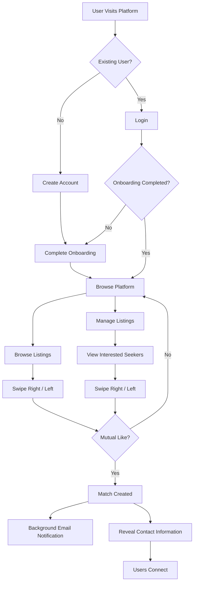
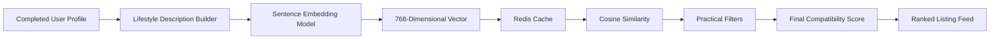
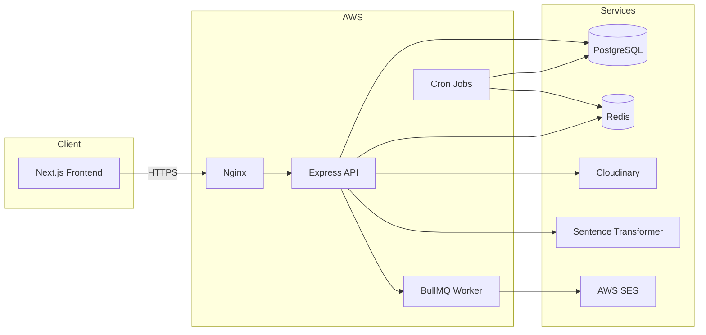
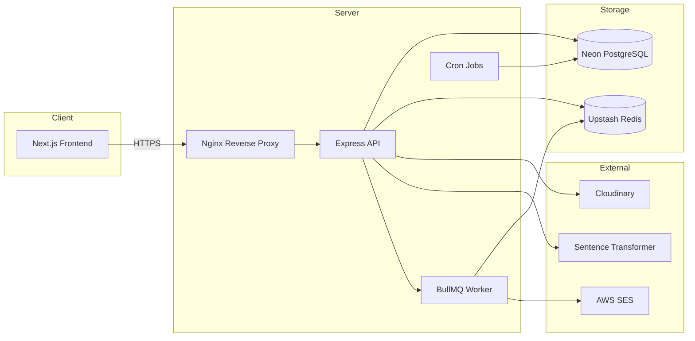
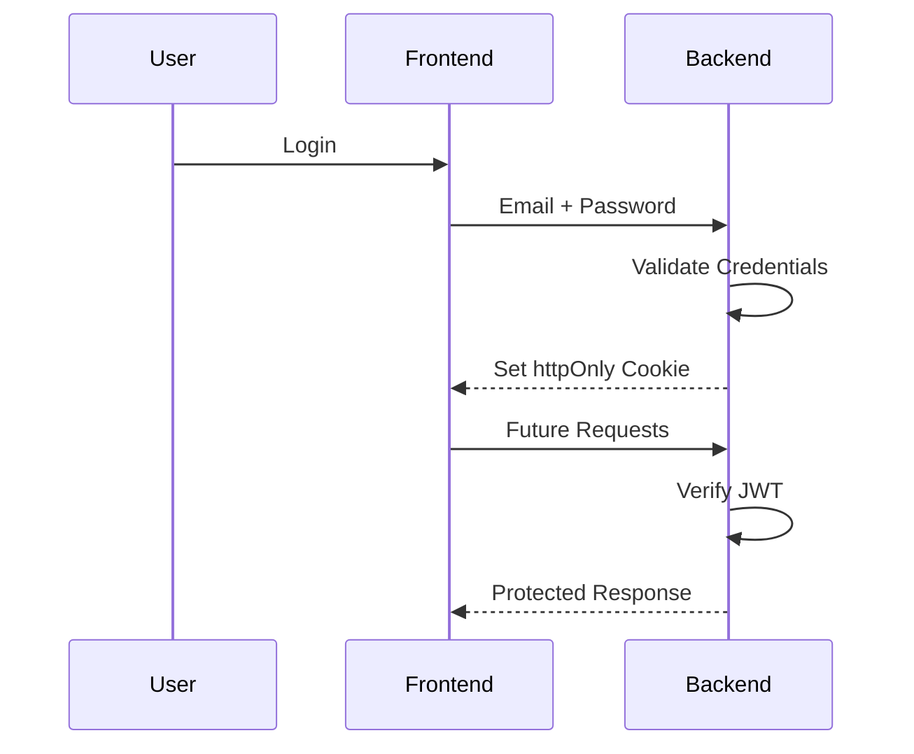
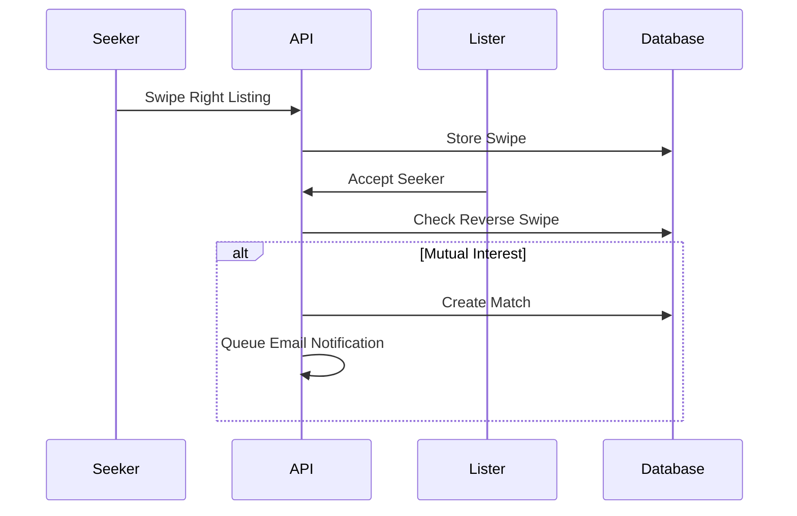

<div align="center">

# 🏠 FlatMateMatch

### AI-powered Flatmate Matching Platform

Find compatible roommates using **Artificial Intelligence**, not just city and budget.

Built as a production-ready full-stack application with a modern cloud-native architecture, intelligent compatibility scoring, asynchronous event processing, secure authentication, automated deployment, and real-world infrastructure.

<br>

[]()
[]
[]
[]
[]
[]
[]
[]
[]
[]
[]
[]
[]

### 🌐 Live Demo

Frontend

https://flat-mate-match-frontend.vercel.app

Backend Health API

https://flatmatematch.duckdns.org/health

</div>

---

# 📑 Table of Contents

- Introduction
- Why FlatMateMatch?
- The Problem
- Product Vision
- Key Features
- Product Overview
- User Roles
- User Journey
- AI Compatibility Engine
- Technology Stack
- System Architecture
- Backend Architecture
- Frontend Architecture
- Database Design
- Authentication Flow
- Swipe & Match Engine
- Email Notification System
- Background Jobs
- Infrastructure
- CI/CD Pipeline
- Security
- Performance Optimizations
- Challenges Faced
- Engineering Decisions
- Future Roadmap
- Screenshots
- Repository Structure
- License

---

# Introduction

FlatMateMatch is an **AI-powered flatmate matching platform** designed to solve one of the biggest problems in shared accommodation:

> Finding a place is easy.
>
> Finding the **right people** to live with is difficult.

Most rental platforms only allow filtering by:

- City
- Budget
- Property Type

While these filters help users discover available properties, they completely ignore the **human compatibility** aspect of sharing a home.

Living with someone involves much more than paying the same rent.

Daily routines, cleanliness, work schedules, social preferences, sleep habits, dietary choices, guest preferences, smoking habits, drinking habits and overall lifestyle determine whether two people can comfortably share a living space.

FlatMateMatch introduces an AI-powered compatibility layer that evaluates these lifestyle factors to recommend people who are genuinely more compatible, rather than simply living in the same city.

Instead of becoming another rental listing website, FlatMateMatch attempts to become a **compatibility-first roommate discovery platform**.

---

# Why FlatMateMatch?

The traditional roommate search process is mostly random.

People typically join Facebook groups, WhatsApp communities or rental platforms and choose roommates based only on:

- Rent
- Location
- Availability

Almost no information exists about whether two strangers will actually enjoy living together.

This often results in problems like:

- Different sleep schedules
- Loud vs quiet personalities
- Different cleanliness standards
- Smoking conflicts
- Drinking conflicts
- Frequent guests
- Different work timings
- Lifestyle incompatibility

FlatMateMatch attempts to reduce these conflicts by recommending people who are more compatible before they even meet.

Instead of asking:

> "Who has a room?"

The platform asks:

> "Who is the best person to live with?"

---

# Product Vision

The long-term vision of FlatMateMatch is to become an intelligent roommate discovery platform where AI assists users throughout the complete roommate journey.

Rather than simply listing available rooms, the platform aims to answer questions such as:

- Which roommate is most compatible?
- Why is this roommate compatible?
- Which lifestyle dimensions match?
- Which habits may create conflicts?
- Which property best suits both people?

As the platform evolves, compatibility scoring can expand beyond lifestyle preferences into:

- Property amenities
- Neighborhood preferences
- Commute distance
- Interests
- Personality signals
- Communication styles
- Verified identity
- Community reputation

The objective is not only to help people **find accommodation**, but to help them **build better living experiences**.

---

# Core Features

| Category | Features |
|-----------|----------|
| Authentication | Secure signup/login using JWT stored in HttpOnly cookies |
| User Profiles | Rich lifestyle profiles with 10+ compatibility dimensions |
| AI Matching | Semantic compatibility using sentence embeddings |
| Listings | Property creation, editing, expiration and lifecycle management |
| Swipe Engine | Tinder-inspired mutual swipe workflow |
| Match System | Automatic mutual match detection |
| Email Notifications | Background email delivery through BullMQ and AWS SES |
| Image Uploads | Cloudinary-hosted profile and listing photos |
| Background Jobs | Automated listing expiry and email retry mechanisms |
| Caching | Redis embedding cache for reduced AI computation |
| Infrastructure | Dockerized deployment with Nginx reverse proxy |
| CI/CD | Fully automated deployment using GitHub Actions |
| Testing | Unit and integration testing with Jest and Supertest |

---

# Product Overview

FlatMateMatch supports two independent user journeys.

## 🧑 Seeker

A seeker is someone searching for accommodation.

The seeker can:

- Complete onboarding
- Build a lifestyle profile
- Browse available listings
- View AI compatibility scores
- Swipe Like or Pass
- Receive matches
- View matched roommate details
- Contact matched listers

---

## 🏠 Lister

A lister is someone who owns or manages a property.

The lister can:

- Create listings
- Upload listing images
- View interested seekers
- Review compatibility information
- Like or reject seekers
- Create mutual matches
- Manage listings

---

# Complete User Journey



---

# What Makes FlatMateMatch Different?

Most roommate platforms stop at filtering.

FlatMateMatch goes further.

Instead of recommending everyone within a city,

it recommends the people **most likely to live well together.**

Compatibility is determined using AI-generated semantic representations of lifestyle preferences rather than manually assigning arbitrary scores to individual questionnaire answers.

This creates a recommendation system that scales naturally as additional profile information is introduced in future versions.

---

# Repository Overview

The complete application consists of multiple independently deployed components.

| Repository | Purpose |
|------------|---------|
| Frontend | Next.js web application |
| Backend | Express REST API |
| Infrastructure | Docker + Nginx + AWS deployment |
| Database | PostgreSQL (Neon) |
| Cache | Upstash Redis |
| Queue | BullMQ |
| Email | AWS SES |
| Images | Cloudinary |

---

---

# 🧠 AI Compatibility Engine

The core differentiator of FlatMateMatch is its AI-powered compatibility engine.

Unlike conventional roommate platforms that rely on rigid filters or manually weighted questionnaire scores, FlatMateMatch transforms a user's lifestyle into a semantic representation and compares users using vector similarity.

Instead of asking:

> "Do these two users have identical answers?"

the system asks:

> "How similar are these two lifestyles overall?"

This allows compatibility to be measured holistically rather than as a checklist of independent fields.

---

## How Compatibility Is Calculated

Every completed onboarding profile is converted into a structured lifestyle description.

For example:

```text
Sleep Schedule: Early Bird
Cleanliness: Very Clean
Smoking: Never
Drinking: Occasionally
Guests: Rarely
Work Schedule: Hybrid
Noise Tolerance: Low
Pets: Comfortable
Interests:
- Gym
- Movies
- Cooking
```

Rather than comparing each answer individually, this text is embedded into a dense numerical vector using a local sentence transformer model.

Each vector captures the semantic meaning of a user's lifestyle.

Users with similar habits naturally produce vectors that are closer together in vector space.

---

## Matching Pipeline



---

## AI Model

FlatMateMatch performs inference locally.

No external AI APIs are called during compatibility scoring.

Current model:

```
all-MiniLM-L6-v2
```

Using the Transformers.js runtime allows embeddings to be generated entirely inside the backend.

Advantages:

- No OpenAI API costs
- No request latency to third-party AI providers
- No user lifestyle data leaves the server
- Fully deterministic embeddings
- Offline inference capability

This makes the recommendation engine inexpensive to operate while keeping user information private.

---

## Why Sentence Embeddings?

Traditional roommate platforms often assign arbitrary points to answers.

Example:

```text
Same sleep schedule → +10

Same cleanliness → +15

Same smoking preference → +20
```

Although simple, this approach becomes increasingly difficult to maintain as more profile dimensions are added.

Instead, FlatMateMatch converts the entire lifestyle profile into a semantic representation.

This enables:

- Better scalability
- Natural understanding of similar responses
- Easier addition of future profile fields
- Less manual weighting logic
- More realistic compatibility measurements

---

## Practical Compatibility Layer

Lifestyle compatibility alone does not make two users suitable roommates.

The platform also considers practical constraints.

Current practical factors include:

- Budget compatibility
- City
- Move-in timeline

These constraints ensure recommendations remain realistic.

For example,

two users may have extremely similar lifestyles,

but if one has a ₹15,000 budget and the listing costs ₹60,000,

the recommendation should naturally rank lower.

---

## Final Ranking Strategy

The final recommendation score combines multiple signals.

```text
Final Score

=

Lifestyle Compatibility

+

Practical Compatibility
```

Conceptually,

```
70% Lifestyle

30% Practical Factors
```

This balance allows personality compatibility to remain the strongest recommendation signal while ensuring recommendations are still financially and geographically realistic.

---

## Why Cache Embeddings?

Generating embeddings repeatedly is unnecessary.

A user's lifestyle rarely changes.

Instead,

FlatMateMatch stores generated embeddings inside Redis.

```mermaid
flowchart LR

User Request

--> Redis Cache

Redis Cache -->|Hit| Return Embedding

Redis Cache -->|Miss| AI Model

AI Model --> Store Cache

Store Cache --> Return Embedding
```

Benefits:

- Lower latency
- Reduced CPU usage
- Faster recommendation generation
- Better scalability

Embeddings are regenerated only when a user updates their profile.

---

# ⚙ Technology Stack

Rather than selecting technologies based purely on popularity, every component was chosen to solve a specific engineering problem.

| Layer | Technology | Purpose |
|--------|------------|---------|
| Frontend | Next.js 15 | Modern React framework with App Router |
| Language | TypeScript | End-to-end type safety |
| Backend | Express 5 | Lightweight REST API framework |
| Database | PostgreSQL (Neon) | Reliable relational storage |
| ORM | Prisma | Type-safe database access |
| AI | Transformers.js | Local embedding generation |
| Cache | Upstash Redis | Embedding cache |
| Queue | BullMQ | Background email processing |
| Email | AWS SES | Transactional email delivery |
| Image Storage | Cloudinary | Profile and listing images |
| Reverse Proxy | Nginx | HTTPS termination and request forwarding |
| Containerization | Docker | Reproducible deployments |
| CI/CD | GitHub Actions | Automated deployment pipeline |
| Hosting | AWS EC2 | Production server |
| Frontend Hosting | Vercel | Automatic frontend deployments |

---

# Why These Technologies?

## Why Next.js?

The frontend is built using Next.js App Router because it provides:

- Excellent routing
- Server rendering support
- Optimized production builds
- Easy deployment on Vercel
- Modern React ecosystem

---

## Why Express?

Express keeps the backend intentionally simple.

The project focuses on business logic rather than framework abstractions.

Express provides:

- Minimal overhead
- Flexible middleware
- Easy testing
- Predictable request flow

---

## Why PostgreSQL?

FlatMateMatch contains multiple highly-related entities:

- Users
- Listings
- Swipes
- Matches

A relational database naturally models these relationships.

PostgreSQL also provides:

- ACID transactions
- Strong indexing
- Foreign keys
- Excellent performance

---

## Why Prisma?

Prisma improves developer productivity by generating fully typed database queries.

Benefits include:

- Compile-time query safety
- Auto-generated types
- Easier migrations
- Cleaner code

---

## Why Redis?

Redis serves two completely different purposes.

### Embedding Cache

Stores generated vectors.

Avoids expensive AI inference.

---

### Queue Backend

BullMQ requires Redis.

Instead of introducing another infrastructure component,

the same Redis instance powers asynchronous jobs.

---

## Why BullMQ?

Email sending should never slow down API responses.

Instead,

API

↓

Create Match

↓

Return Success

↓

Queue Email

↓

Worker Sends Email

This architecture keeps user interactions responsive even if email delivery becomes slow.

---

## Why Cloudinary?

Images are never stored on the application server.

Benefits:

- CDN delivery
- Image optimization
- Reduced server storage
- Easier scaling

---

## Why Docker?

Docker guarantees identical environments across:

- Development
- Testing
- Production

The same container image is deployed everywhere.

---

# 🏗 High-Level System Architecture



---

# Backend Responsibilities

The backend is responsible for every business-critical operation.

These responsibilities include:

- Authentication
- Authorization
- Profile onboarding
- Listing management
- Swipe system
- AI compatibility scoring
- Match generation
- Image uploads
- Email notifications
- Queue management
- Scheduled jobs
- Security validation
- Database persistence

The frontend never computes compatibility scores or determines authorization rules.

All critical decisions are made server-side.

---

# Frontend Responsibilities

The frontend focuses entirely on user experience.

Responsibilities include:

- Authentication screens
- Multi-step onboarding
- Listing creation
- Browse experience
- Flip-card interactions
- Match views
- Profile editing
- Form validation
- API communication

Business rules remain inside the backend, ensuring consistency regardless of client platform.

---

---

# 🏗️ System Architecture

FlatMateMatch follows a layered architecture where each service has a single responsibility.

The frontend is responsible for the user experience, while the backend manages authentication, AI matching, business logic, validation, data persistence, and asynchronous processing.

Long-running operations such as email delivery are processed independently to keep API responses fast and responsive.

---

## High Level Architecture



---

## Request Lifecycle

Every request passes through the following pipeline before reaching the database.

```text
Client
   │
   ▼
Nginx
   │
   ▼
Express
   │
   ▼
Authentication
   │
   ▼
Validation
   │
   ▼
Business Logic
   │
   ▼
Database
   │
   ▼
Response
```

Each layer has a single responsibility, making the application easier to maintain and extend.

---

## Authentication Flow

FlatMateMatch authenticates users using **JWT stored inside httpOnly cookies**.

Unlike Local Storage based authentication, the browser automatically attaches the cookie to every request while JavaScript cannot access it.



### Advantages

- JWT never exposed to client-side JavaScript
- Protection against token theft through XSS
- Automatic browser session management
- Secure cross-origin authentication over HTTPS

---

## AI Recommendation Pipeline

When a user opens the Browse page, every listing is scored dynamically.

```text
Load User

        │
        ▼

Retrieve Cached Embedding

        │
        ▼

Generate Missing Embedding
(if required)

        │
        ▼

Load Candidate Listings

        │
        ▼

Calculate
Cosine Similarity

        │
        ▼

Calculate
Budget Compatibility

        │
        ▼

Calculate
Move-in Compatibility

        │
        ▼

Merge Scores

        │
        ▼

Sort Descending

        │
        ▼

Return Ranked Listings
```

No compatibility score is permanently stored inside the database.

Scores are calculated whenever recommendations are requested.

---

## Match Creation Workflow

A match exists only when **both users express mutual interest**.



User contact details remain hidden until a successful match is created.

---

## Email Notification Pipeline

Email sending is completely asynchronous.

The API never waits for emails to be delivered before responding.

```text
Match Created

      │
      ▼

BullMQ Queue

      │
      ▼

Worker

      │
      ▼

AWS SES

      │
      ▼

Success
or
Retry Logic
```

This keeps response times low while allowing temporary failures to be retried later.

---

## Scheduled Background Jobs

Several maintenance operations run automatically without user interaction.

| Job | Purpose |
|------|----------|
| Listing Expiry | Marks listings inactive after their lifetime expires |
| Listing Cleanup | Permanently removes expired listings after the retention period |
| Failed Email Retry | Re-queues temporary email delivery failures |

These jobs execute independently using cron scheduling.

---

## Redis Responsibilities

Redis is used for multiple independent workloads.

### AI Embedding Cache

Stores generated sentence embeddings to avoid repeated inference.

---

### BullMQ Queue

Acts as the message broker between the API and the email worker.

---

### Rate Limiting

Protects external services from excessive requests.

---

Using Redis for multiple workloads minimizes infrastructure while improving performance.

---

## Database Design

Persistent application data is stored in PostgreSQL using Prisma ORM.

Core entities include:

```text
User
 │
 ├── Listings
 │
 ├── Swipes
 │
 └── Matches

FailedEmailNotification
```

Prisma provides:

- Type-safe queries
- Schema migrations
- Relationship validation
- Compile-time query safety

---

## Media Storage

Application containers never store uploaded files.

```text
Browser

   │
   ▼

Backend

   │
   ▼

Cloudinary

   │
   ▼

Image URL

   │
   ▼

Database
```

Only secure Cloudinary URLs are stored inside PostgreSQL.

---

## Production Deployment

```mermaid
flowchart LR

Internet

↓

DuckDNS Domain

↓

HTTPS

↓

Nginx

↓

Docker Container

↓

Express API

↓

Neon PostgreSQL

Upstash Redis

Cloudinary

AWS SES
```

Nginx terminates HTTPS traffic before forwarding requests to the Docker container running the backend application.

---

## Docker Architecture

The backend is packaged using a multi-stage Docker build.

```text
Builder Stage

↓

Install Dependencies

↓

Generate Prisma Client

↓

Compile TypeScript

↓

Production Stage

↓

Copy Build Output

↓

Run Application
```

This produces a significantly smaller production image while keeping development dependencies out of the final container.

---

## Continuous Deployment

Every push to the **main** branch automatically deploys the latest backend.

```mermaid
flowchart LR

Developer

↓

Push to GitHub

↓

GitHub Actions

↓

Build Docker Image

↓

Push Docker Hub

↓

SSH into EC2

↓

Pull Latest Image

↓

Restart Container

↓

Application Live
```

Once the infrastructure was configured, no manual deployment steps were required.

---

## Design Principles

FlatMateMatch was built around several engineering principles.

- Stateless backend services
- Separation of concerns
- AI used as a recommendation layer rather than replacing business logic
- Asynchronous processing for slow operations
- Production-ready containerized deployment
- Managed cloud services where appropriate
- Secure authentication using httpOnly cookies and HTTPS
- Modular architecture for future scalability

These principles keep the application maintainable while remaining deployable on low-cost cloud infrastructure.


---

# ⚙️ Backend Features

The backend powers every part of FlatMateMatch, from authentication and onboarding to AI-powered recommendations and asynchronous notifications.

Rather than exposing raw database operations, every feature is built around business rules that ensure data consistency, security, and a predictable user experience.

---

## Authentication

Authentication is implemented using JWT stored inside **httpOnly cookies**.

### Features

- User registration
- Secure login
- Logout
- Password hashing using bcrypt
- Protected routes
- Persistent browser sessions
- Automatic authentication middleware

Passwords are never stored in plaintext and authentication tokens are never accessible from client-side JavaScript.

---

## User Onboarding

Every new user must complete onboarding before accessing the platform.

The onboarding process captures:

- Profile photo
- Name
- City
- Budget
- Move-in date
- Personal bio
- Lifestyle preferences
- Interests

Completing onboarding unlocks browsing, listings, and matching functionality.

This ensures every recommendation has sufficient information for meaningful compatibility scoring.

---

## Listing Management

Users can create rental listings directly from the application.

Each listing includes:

- Property photo
- Title
- City
- Budget
- Move-in date
- Description

### Business Rules

- Listing creation is atomic
- Listings require a photo
- Listings become read-only once matched
- Expired listings are automatically archived
- Old expired listings are permanently removed

---

## AI Recommendation Engine

Every browse request generates personalized recommendations.

Instead of sorting by newest listings, FlatMateMatch calculates a compatibility score for every candidate listing.

The recommendation engine considers:

- Lifestyle similarity
- Budget compatibility
- Move-in date compatibility

Listings are returned in descending compatibility order.

---

## Swipe System

The application supports two different swipe flows.

### Seeker

Likes or passes rental listings.

### Lister

Reviews interested seekers and decides whether to accept them.

Only mutual interest creates a match.

This prevents unnecessary contact between users who are not interested in each other.

---

## Match System

Once both users swipe positively,

the backend automatically:

- Creates a Match
- Unlocks profile visibility
- Reveals contact information
- Queues notification emails

No manual approval is required.

---

## Email Notifications

Email delivery happens asynchronously using BullMQ.

When a match is created:

```text
Create Match

↓

Queue Email

↓

Worker

↓

AWS SES

↓

Success / Retry
```

The API responds immediately while the worker handles email delivery independently.

---

## Background Processing

Several maintenance tasks run automatically.

Current scheduled jobs include:

| Job | Description |
|------|-------------|
| Listing Expiry | Marks inactive listings |
| Listing Cleanup | Permanently removes expired listings |
| Email Retry | Retries temporary email failures |

These jobs run independently without affecting user requests.

---

# 🗄 Database Design

The application uses PostgreSQL with Prisma ORM.

Core models include:

| Model | Responsibility |
|--------|----------------|
| User | User profile and lifestyle information |
| Listing | Rental listings |
| Swipe | Records every swipe action |
| Match | Stores successful matches |
| FailedEmailNotification | Tracks failed notification attempts |

Relationships are enforced using Prisma, ensuring referential integrity across the application.

---

# 🔒 Security

Security was considered throughout the application rather than added later.

### Authentication

- JWT stored in httpOnly cookies
- Secure cookies in production
- HTTPS-only communication
- Cookie-based session authentication

### Passwords

- bcrypt hashing
- Passwords never logged
- Passwords never returned in API responses

### Authorization

Every protected endpoint verifies:

- User identity
- Resource ownership
- Onboarding completion

Users cannot access or modify resources they do not own.

### Input Validation

Every incoming request is validated using Zod before reaching business logic.

Invalid requests never reach the database.

### Environment Variables

Sensitive credentials are injected at runtime.

Examples include:

- Database credentials
- JWT secrets
- AWS credentials
- Cloudinary keys
- Redis configuration

No secrets are committed to source control.

---

# 🧪 Testing

Testing is performed using Jest and Supertest.

Coverage includes:

- Authentication
- Middleware
- Controllers
- Validation Schemas
- AI utility functions
- Integration tests
- Database operations

Tests are executed against a dedicated test database to isolate development data.

---

# 🚀 Performance Optimizations

Several optimizations were introduced during development.

### Embedding Cache

AI embeddings are cached inside Redis to avoid repeated inference.

---

### Queue-based Email Delivery

Email sending never blocks API responses.

---

### Multi-stage Docker Build

Reduces production image size while excluding unnecessary development dependencies.

---

### Database Indexing

Frequently queried fields are indexed to improve search performance.

---

### Stateless Backend

Application containers remain stateless.

Persistent state is stored in managed cloud services.

---

# 📈 Future Improvements

The current implementation serves as the Minimum Viable Product (MVP).

Planned improvements include:

## AI

- Per-dimension compatibility explanations
- Improved weighting strategy
- LLM-assisted bio similarity
- Location-aware recommendations

## Product

- Real-time messaging
- User verification
- Multiple property photos
- Saved listings
- Swipe history
- Notification center

## Infrastructure

- Production AWS SES access
- Automated CI test gates
- Monitoring and centralized logging
- Horizontal container scaling
- Custom production domain

---

# 📄 License

This repository is currently maintained as a private project.

A public release may be considered in the future.

---

# 👨‍💻 Author

**Akshat Gupta**

Full Stack Software Engineer

FlatMateMatch was designed and built end-to-end, including:

- Product architecture
- Database design
- Backend development
- Frontend development
- AI recommendation engine
- Dockerization
- CI/CD automation
- Cloud deployment
- Infrastructure configuration

---

<div align="center">

**Built with TypeScript, AI, Docker, and modern cloud infrastructure.**

⭐ If you found this project interesting, consider giving it a star.

</div>
